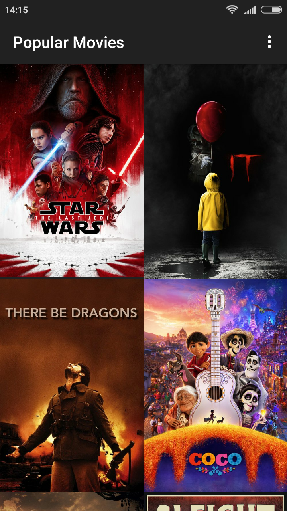
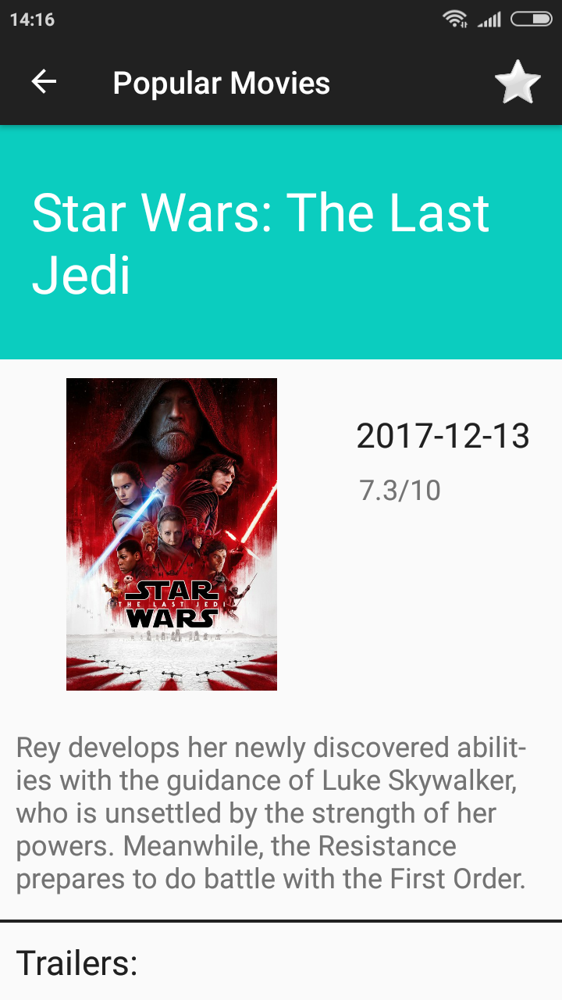

# Android Popular Movies App
This app presents the user with a list of popular movies available coming out the world over.

## Screenshots
 

## Demo

## Features
* The app gets updated in real-time
* Comes with three filters
  * Sort by popularity
  * Sort by ratings
  * Sort by favorites which reflects the personal favorites of the user
* Allows users bookmark their favorite movies and also unbookmak them
* Displays trailers
* Displays reviews
  
## Technical Details
* Makes use of **AsyncTask Loader** for fetching data from network as well as from the database.
* Makes use of **Hetrogenous RecyclerView** for displaying movie details such as rating, poster, trailers and reviews.
* Makes use of **SQLiteDatabase** for storing personal favorite movies.
* Makes use of **Picasso Library** for loading images
* Makes use of **Content Providers** for reading, writing, updating and deleting from the database.

## Video Demo
Demo Video Of The App: https://youtu.be/T_juvebD79E
